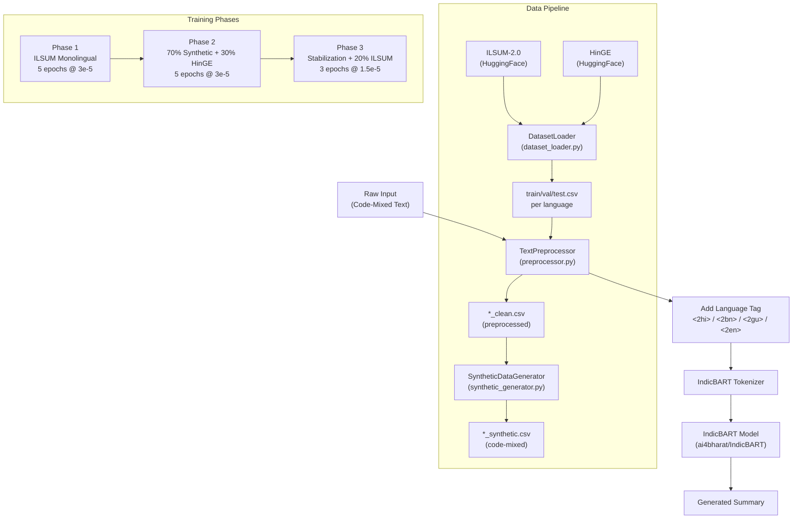

# Project Analysis: Multilingual Code-Mixed Text Summarization

## 🎯 What You're Building

A **deep learning-based abstractive summarization system** for **code-mixed multilingual text** (e.g., Hinglish, Banglish, Gujarati-English) using **IndicBART** (`ai4bharat/IndicBART`), trained without any external translation APIs.

**Target audience:** Internship/research portfolio project.

---

## 🏗️ Architecture Overview



---

## 📁 Codebase Structure & File-by-File Status

### ✅ FULLY IMPLEMENTED (substantial code)

| File | Lines | What it does | Status |
|------|-------|--------------|--------|
| `src/components/data/dataset_loader.py` | 366 | Loads ILSUM-2.0 (4 langs) + HinGE from HuggingFace, splits 70/15/15, saves CSVs | ✅ Complete |
| `src/components/data/preprocessor.py` | 490 | NFC normalization, URL/HTML/control char removal, zero-width char removal, language tag prepending | ✅ Complete |
| `src/components/data/synthetic_generator.py` | 784 | Dictionary-based 20-40% word replacement to create code-mixed data for Hindi, Bengali, Gujarati | ✅ Complete |
| `src/exception/exception.py` | 22 | Custom `CodeMixedSummarizationException` with filename + line number | ✅ Complete |
| `src/logging/logger.py` | 16 | Timestamped file-based logging | ✅ Complete |
| `setup.py` | 43 | Package definition, `codemix-summarizer` CLI entry point | ✅ Complete |

---

### 🕳️ STUB ONLY (docstring only, no implementation)

| File | What it SHOULD do | Status |
|------|-------------------|--------|
| `src/components/model/model_loader.py` | Load `ai4bharat/IndicBART` via `AutoModelForSeq2SeqLM`, handle CPU/GPU placement | ❌ Empty stub |
| `src/components/model/trainer.py` | HuggingFace Trainer wrapper for seq2seq, reads phase YAML configs | ❌ Empty stub |
| `src/components/model/tokenizer_utils.py` | Add special language tag tokens, handle input truncation, decode token IDs | ❌ Empty stub |
| `src/components/evaluation/rouge_scorer.py` | Compute ROUGE-1, ROUGE-2, ROUGE-L using `rouge-score` library | ❌ Empty stub |
| `src/components/evaluation/bert_scorer.py` | BERTScore semantic similarity evaluation | ❌ Empty stub |
| `src/components/inference/predictor.py` | End-to-end inference: preprocess → tag → tokenize → generate → decode | ❌ Empty stub |
| `src/components/inference/language_detector.py` | Detect dominant language from input text to auto-select language tag | ❌ Empty stub |
| `src/pipelines/train_phase1.py` | Run Phase 1 training pipeline end-to-end | ❌ Empty stub |
| `src/pipelines/train_phase2.py` | Run Phase 2 training pipeline end-to-end | ❌ Empty stub |
| `src/pipelines/train_phase3.py` | Run Phase 3 training pipeline end-to-end | ❌ Empty stub |
| `src/pipelines/generate_synthetic.py` | Standalone script to generate synthetic data | ❌ Empty stub |
| `src/pipelines/evaluate.py` | Run evaluation pipeline | ❌ Empty stub |
| `src/pipelines/inference_pipeline.py` | CLI inference script | ❌ Empty stub |
| `app.py` | FastAPI/Gradio web app exposing `/summarize` endpoint | ❌ Empty stub |
| `tests/test_preprocessor.py` | Unit tests for preprocessor | ❌ Empty stub |
| `tests/test_synthetic_gen.py` | Unit tests for synthetic generator | ❌ Empty stub |
| `tests/test_predictor.py` | Integration test for inference pipeline | ❌ Empty stub |

---

### ⚙️ CONFIGS (complete)

| File | Content |
|------|---------|
| `src/configs/model_config.yaml` | `ai4bharat/IndicBART`, max_input: 512, max_output: 128, lang tags |
| `src/configs/phase1_train.yaml` | 5 epochs, lr=3e-5, batch=2, grad_accum=8, mixed_precision=true |
| `src/configs/phase2_train.yaml` | 70% synthetic + 30% real, 5 epochs, load from phase1 checkpoint |
| `src/configs/phase3_train.yaml` | 20% ILSUM mix, 3 epochs, lr=1.5e-5, load from phase2 checkpoint |
| `src/configs/inference_config.yaml` | 4 beams, length_penalty=1.0, no_repeat_ngram=3, max_new=128 |

---

## 📊 Data Pipeline Progress

### What's Already Done ✅

The data pipeline has been **fully run** — real processed files exist on disk:

| Stage | Location | Status |
|-------|----------|--------|
| **ILSUM Raw** (4 langs: Hindi/Bengali/English/Gujarati) | `artifacts/data/ilsum_processed/[lang]/train,val,test.csv` | ✅ Downloaded & split |
| **ILSUM Preprocessed** (cleaned + language tags) | `artifacts/data/preprocessed/[lang]/train_clean.csv` etc. | ✅ Preprocessed |
| **Synthetic Code-Mixed** (Hindi/Bengali/Gujarati) | `artifacts/data/synthetic_codemixed/[lang]/train_synthetic.csv` etc. | ✅ Generated |
| **HinGE Real Code-Mixed** (Hinglish→English) | `artifacts/data/real_codemixed/train,val,test.csv` | ✅ Downloaded & split |
| **Dictionaries** (Hindi/Bengali/Gujarati → English JSON) | `artifacts/data/dictionaries/` | ✅ Saved |

> **Evidence of scale:** Hindi train split alone is ~128MB. HinGE train is ~484KB. All data is ready.

### What's NOT Yet Done ❌

- Checkpoints: `artifacts/checkpoints/phase1,2,3/` — all empty (`.gitkeep` only)
- No model has been trained yet

---

## 🔑 Key Design Decisions

| Decision | Choice | Reason |
|----------|--------|--------|
| **Model** | `ai4bharat/IndicBART` | Native Indic language support, ~244M params, seq2seq |
| **Real code-mixed data** | HinGE (LingoIITGN/HinGE) | Hinglish → English pairs; Human-generated column = input, English column = target |
| **Synthetic generation** | Dictionary-based word swapping (20-40%) | No POS tagger needed; ~300 high-freq content words per language |
| **Language tag** | `<2hi>`, `<2bn>`, `<2gu>`, `<2en>` | IndicBART official format; Hinglish uses `<2hi>` (Hindi dominant) |
| **Summary column** | Never code-mixed, never tagged | Model learns to produce clean output from noisy input |
| **3-phase training** | Mono → Code-mixed → Stabilize | Prevents forgetting; builds capability gradually |
| **Data splits** | 70/15/15 | Custom split applied uniformly to all datasets |

---

## 🚧 What Needs to Be Built Next

### Priority order (dependencies flow top to bottom):

```
1. model_loader.py          ← Load IndicBART + tokenizer
2. tokenizer_utils.py       ← Tokenize inputs + add special tokens
3. trainer.py               ← HuggingFace Seq2SeqTrainer wrapper
4. train_phase1.py pipeline ← Run Phase 1 end-to-end
5. rouge_scorer.py          ← Evaluate ROUGE after each phase
6. train_phase2.py pipeline ← Run Phase 2 (needs phase1 checkpoint)
7. train_phase3.py pipeline ← Run Phase 3 (needs phase2 checkpoint)
8. predictor.py             ← Inference on new input
9. language_detector.py     ← Auto-detect dominant language
10. inference_pipeline.py   ← CLI wrapper
11. app.py                  ← FastAPI/Gradio demo
12. Unit tests              ← test_preprocessor, test_synthetic_gen, test_predictor
```

---

## 🐛 Potential Issues to Address

> [!WARNING]
> **`model_config.yaml` language tag mismatch:** The config lists `<2hi>`, `<2ta>`, `<2en>` — but `preprocessor.py` uses `<2hi>`, `<2bn>`, `<2gu>`, `<2en>`. Tamil (`<2ta>`) is in the config but NOT in the preprocessor or anywhere else. Bengali (`<2bn>`) and Gujarati (`<2gu>`) are missing from the config. This needs to be reconciled.

> [!NOTE]
> **`requirements.txt` is missing `sklearn`** (`scikit-learn`) which is imported in `dataset_loader.py` for `train_test_split`. Also missing `pandas`.

> [!NOTE]
> **`transliterator.py`** exists as a file (161 bytes) and is listed in the directory but was not yet read — it likely contains just a docstring stub relating to the optional `indic-transliteration` step.

---

## 📋 Summary State

| Area | Status |
|------|--------|
| Project structure & scaffolding | ✅ Done |
| Data loading (ILSUM + HinGE) | ✅ Done |
| Text preprocessing | ✅ Done |
| Synthetic data generation | ✅ Done |
| All data on disk (ready for training) | ✅ Done |
| Configuration YAMLs | ✅ Done |
| Model loading | ❌ Not started |
| Training (all 3 phases) | ❌ Not started |
| Evaluation (ROUGE/BERTScore) | ❌ Not started |
| Inference pipeline | ❌ Not started |
| Web app | ❌ Not started |
| Unit tests | ❌ Not started |
